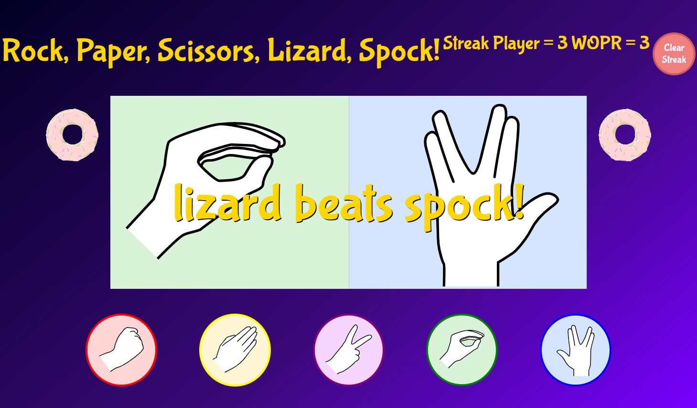
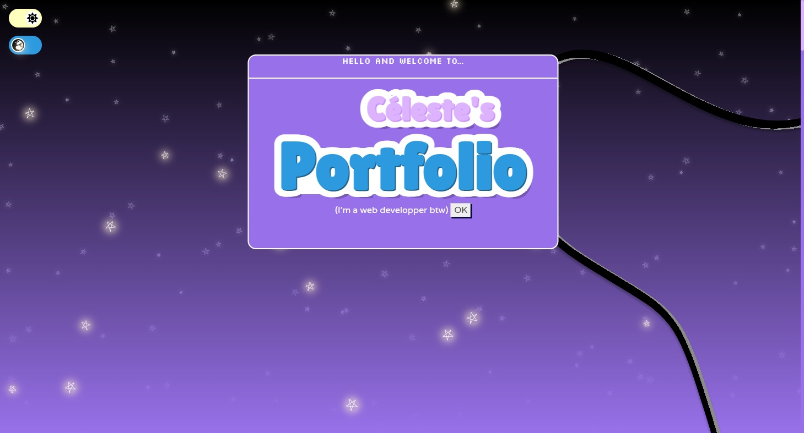
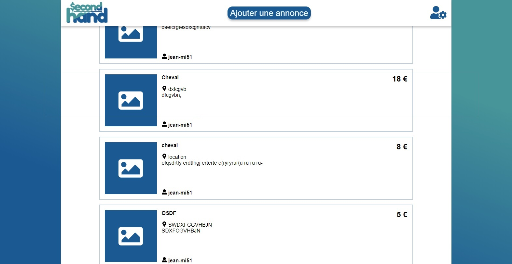

  <h1 align="center"> ⭐ Hello and welcome ⭐   to Celeste's GitHub profile! </h1>

---

 Hi, my name is Céleste, I am a french, twenty-something years old student attending the Access Code School course in Lons-le-Saunier (France), I am learning back and front end web development for desktop and mobile devices. 💻 

---

<h2 align="center"> Some of my projects 👓 </h2> 
 

  
  
  
  <a href=https://github.com/Plumtree3D/music-band>
  

  
  
  </a>
  
  

---

     &nbsp;
     &nbsp;
     &nbsp;

 
 

  

